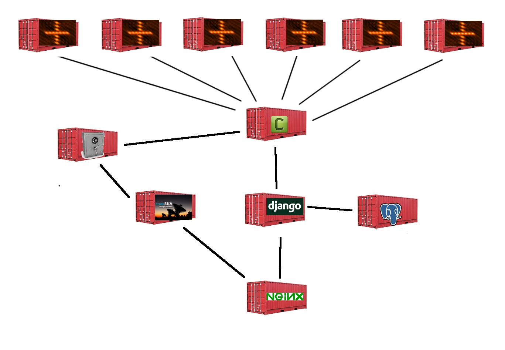

Design
======

important concepts
==================

Docker
------

Docker is a platform for containing applications (containers) and run them.

https://www.docker.com/

Django
------

Django is a python based web framework. Most code in this repository is actually
the Django application running inside a container.

https://www.djangoproject.com/

Celery
------

This is a job schedular and message quing system. We use it to schedule and
manage simulations. It is tightly coupled with the Django application, uses
the same code base and configuration file.

http://www.celeryproject.org/

Nginx
-----

As a central entry point and reverse proxy we use nginx. This is a tiny
webserver that will route HTTP requests to the correct container. Communication
with the Django container is done using WSGI and a socket.

http://nginx.org/

PostgreSQL
----------

For simulation metadata storage we use a PostgreSQL database. We use a
postgresql container from the docker hub. No configuration (username/password)
is required, all linked containers can read and write the database.

http://www.postgresql.org/

Cyber SKA viewer
----------------

A browser based FITS file viewer.

https://github.com/ska-sa/cyberska_viewer
https://registry.hub.docker.com/u/gijzelaerr/cyberska_viewer/

